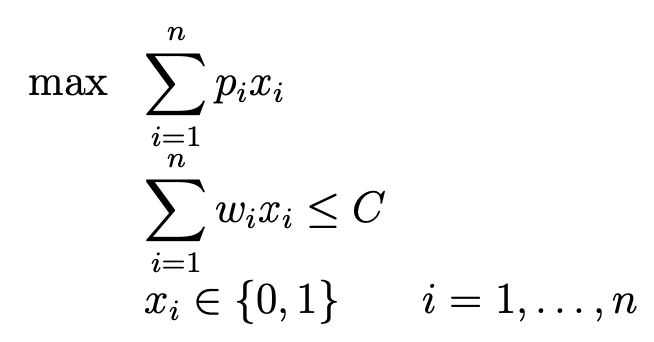
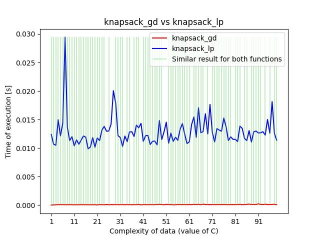
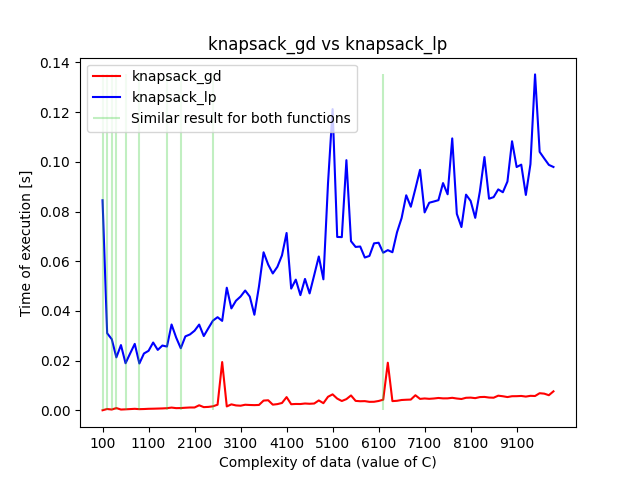

# Knapsack problem - linear programming vs. naive heuristic

## Problem

We need to pack a knapsack which has certain capacity (_C_ - e.g. 20 kg). There
are several (_n_) items that can be loaded into it. Each item has its weight
(_w_ - e.g. 2 kg) and value (_p_ - e.g. 30 €). The task is to choose a subset
of items that (1) can be stored inside knapsack, so that it is not overloaded
and (2) their total value is maximal.

We can write the problem with following equations:

This problem can be solved with multiple approaches. We selected two methods
and, after they had been implemented, we compared their efficiency.

## Methods

### Linear programming

First method was implemented using linear programming approach. We just
rewrote equations into the syntax of the selected library
([pulp](https://coin-or.github.io/pulp/index.html)). We used
[CBC](https://projects.coin-or.org/Cbc) solver to tackle equations. As a result
we obtained function _knapsack_gd_ in the script
[linprog_method.py](./linprog_method.py).

It's good to mention that this approach guaranteed to obtain optimal solution
for the problem.

### Naive heuristic

Second method was a greedy heuristic. We borrowed some ideas from
[article](https://www.pythonpool.com/knapsack-problem-python/) available
online and improved it. The operation principle was to (1) compute 'usability'
for each item (as its _p/w_), (2) sort all items descending by that feature and
(3) pack item by item to the knapsack following obtained sequence until it is
full. This method has been implemented as function _knapsack_gd_ in the script
[greedy_method.py](./greedy_method.py).

Of course this method, as all heuristics, didn't guarantee to obtain optimal
solution.

## Setting up experiment

To answer the question "which of two methods is better" we prepared an
experiment to compare (1) time efficiency and (3) correctness of algorithms as
a function of data complexity.

### Data generator

As first step, a utility that generates data with varying 'complexity' was
implemented. Every tuple of created dataset had to meet following conditions:

- sum of weights of items must be smaller than _1.3C_
- each item can have weight from range _[1, 10]_
- each item can have value from range _[1, 10]_

The parameter that determined a 'complexity' of the data was _C_, such that
_C_ of *j*th generated tuple is _50_ units higher than _C_ of *j-1*th generated
tuple.

Function that generates data can be found in
[data_generator.py](./data_generator.py) script.

### An 'engine'

In order to compute results, we prepared a dedicated set of functions
([timer.py](./timer.py)). Their responsibility was to measure time of execution
of each evaluated method for varying input data, check if result obtained for
greedy approach is optimal and visualise experiment on the chat.

## Results and discussion

We ran several experiments for different ranges of _C_. As a result, an
interesting phenomena has been observed for small and relatively big values of
_C_ (see figures below):

Analysis of the charts can tell us that greedy implementation is much faster
than its linear counterpart. Here, it's good to mention, that function
_knapsack_gd_ wasn't implemented to meet high-efficiency condition.

We can also notice, that _knapsack_gd_ is accurate almost as linear programming
implementation for small _C_. However, for higher complexity of data it is
getting less precise, so that it cannot find optimal solution!

## Conclusions

Experiment that has been conducted using this codebase was intended to show
differences in solving the knapsack problem with linear programming framework
and heuristic. Without surprises, we were able to see, that those two,
competitive methods have their own advantages and drawbacks. There is a
trade-off between time efficiency and precision of obtained result. Therefore,
it's very important to determine the exact nature of the problem before
implementation. When it comes to accuracy, linear programming wins, but when
speed is the main goal, and we don't care if the result will be optimal -
greedy method should be chosen.

## How to run the code

- create environment (`conda create --name knapsack python=3.9`)
- activate environment (`conda activate knapsack`)
- install required libraries (`pip install -r requirements.txt`)
- run `main.py` (`python main.py`)

## References

\[1\] https://coin-or.github.io/pulp/index.html  
\[2\] https://www.pythonpool.com/knapsack-problem-python/  
\[3\] https://realpython.com/linear-programming-python/#linear-programming-python-implementation  
\[4\] https://projects.coin-or.org/Cbc
